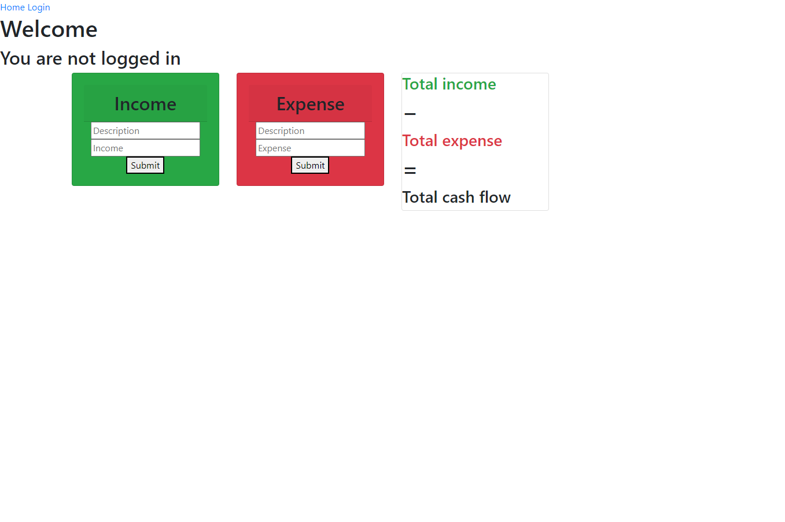

# Financial-Tracker

## Description

Do you have financial issues? Is it so hard to keep track of your expenses? We have the perfect website for you...

Enter Financial-Tracker: Sign Up! and Input your income source and any description of expenses with the corresponding amount. All the input data introduced by the user and submited will be store in a mysql database in the back-end system, allowing the user to keep a control database of all his/her expenses and income. The app will be deployed at live URL on Heroku. 

Link to the deploy website: 

## Installation

The repo contains a server.js file, a views folder containing the login features, an utils folder, a seeds folder, a public folder, a models folder, a db folder, a controllers folder, a config folder, an images folder containing an image overview of the app. These files were deployed at the above-mentioned link using Heroku. The repo can also be cloned to a local machine.

##Website
https://sleepy-cliffs-13403.herokuapp.com/

## Usage

Using any desktop browser, open the above-mentioned link to view the webpage.

## Credits

Collaborators include the instructor, TAs, and fellow classmates of the UCF Coding Bootcamp (Spring 2022).

## License

Copyright (c) 2022 Financial Tracker

Permission is hereby granted, free of charge, to any person obtaining a copy of this software and associated documentation files (the "Software"), to deal
in the Software without restriction, including without limitation the rights to use, copy, modify, merge, publish, distribute, sublicense, and/or sell copies of the Software, and to permit persons to whom the Software is furnished to do so, subject to the following conditions:

The above copyright notice and this permission notice shall be included in all copies or substantial portions of the Software.

THE SOFTWARE IS PROVIDED "AS IS", WITHOUT WARRANTY OF ANY KIND, EXPRESS OR IMPLIED, INCLUDING BUT NOT LIMITED TO THE WARRANTIES OF MERCHANTABILITY,
FITNESS FOR A PARTICULAR PURPOSE AND NONINFRINGEMENT. IN NO EVENT SHALL THE AUTHORS OR COPYRIGHT HOLDERS BE LIABLE FOR ANY CLAIM, DAMAGES OR OTHER LIABILITY, WHETHER IN AN ACTION OF CONTRACT, TORT OR OTHERWISE, ARISING FROM, OUT OF OR IN CONNECTION WITH THE SOFTWARE OR THE USE OR OTHER DEALINGS IN THE SOFTWARE.

## Badges

